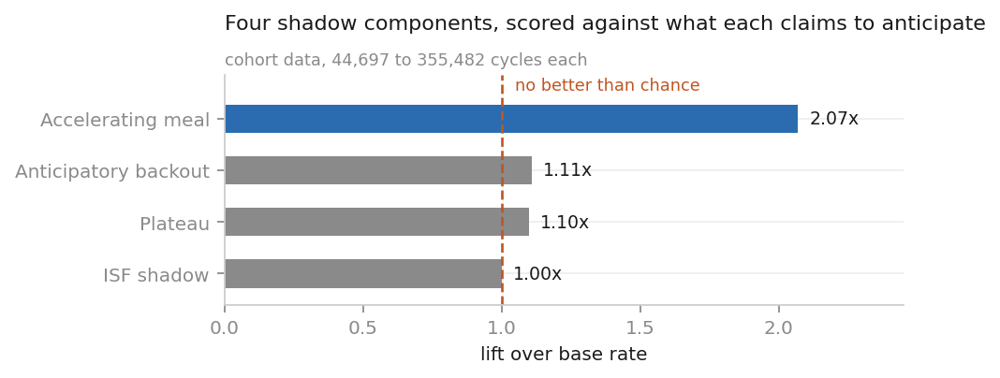
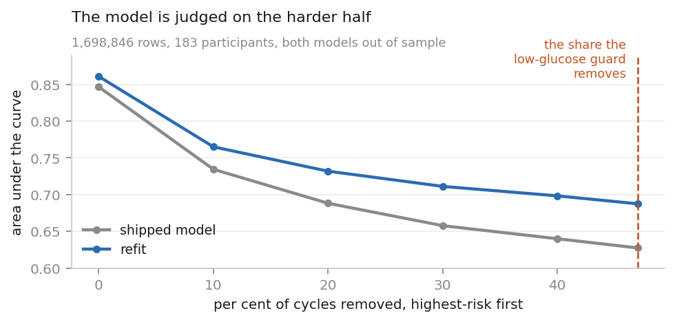
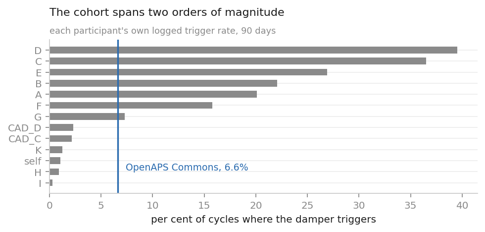
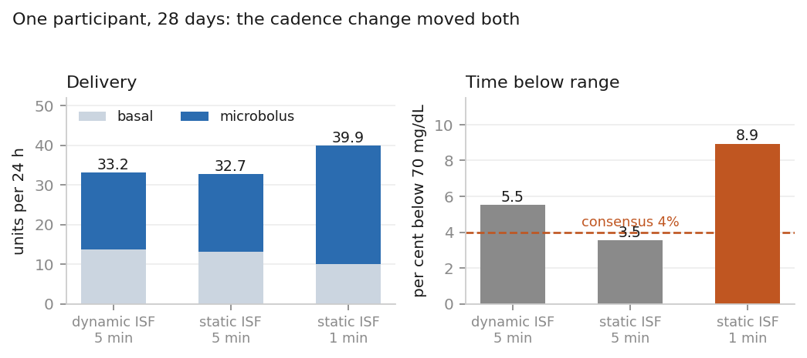

# Boost: the current design, and what measuring it has changed

*The usual preamble, because it matters. Everything described here is highly experimental. It uses insulin in an off-label fashion, it isn't in any released, supported version of AndroidAPS or Trio, and nothing here is medical advice. It's an n=1 that's grown into a slightly-larger-than-n=1, shared in the open-source, #WeAreNotWaiting spirit so the learning is useful to others. Take the ideas, not the dose settings.*

---

I've written about Boost twice before at any length: once when it was [a possibility](https://www.diabettech.com/fully-closed-loop-with-an-open-source-aid-system-a-possibility/), and once when [V6 arrived](https://www.diabettech.com/) and I described how it had stopped thinking in tiers and started thinking in meals. Both of those were, broadly, "here's a thing I built and here's why I think it helps."

This one is a bit different. At some point I stopped adding things to Boost and started measuring the things already in it, which is a different activity and tends to retire more than it confirms. So: what Boost was for, how it got to where it is, what's in it now, where the machine learning sits, and which parts of it have earned their place.

## What it was for

Boost has one job, and it's the same job it had at the start: run a closed loop without telling it about food.

That's a harder ask than it sounds, and the reason is insulin, not software. Injected under the skin, insulin takes the best part of an hour to do most of its work. A meal is largely absorbed inside that window. So if you wait until the rise is obvious before you dose — which is what a conservative loop does, quite sensibly — you're always behind it, and no amount of cleverness afterwards gets that time back.

The original Boost kept the whole AndroidAPS engine and replaced exactly one thing: the decision about how big the next micro-bolus should be. Basal, dynamic sensitivity, the predictions and **every safety gate** stayed exactly as they were. That constraint was deliberate, it's still there, and it's the main reason I've been willing to run this on myself for as long as I have. The parts that stop you coming to harm are the parts that have been stopping people coming to harm for years.

What went in place of that one decision, first time round, was a ladder of eight tiers, each licensing a bit more aggression than the last, with a small machine-learning model watching for hypo risk whose only power was to shrink whatever the ladder had just chosen. Be braver into a rise; have something that can pull you back.

It worked, in the sense that it produced a usable fully closed loop: 81.2% time in range and 5.6% below over four months. It also produced post-meal highs I wasn't thrilled about and lines noticeably wider than my hybrid setup, and I said so at the time.

## How it got here

The lineage runs V1, V2, V3, v4.4, v4.4.2, then V6, with a V7 sitting in shadow now. The version numbers aren't worth dwelling on, but two of the changes underneath them are.

**The loop grew a memory.** The ladder decided everything from scratch every five minutes, so it had no way of representing "I think a meal started twenty minutes ago and I've already dealt with it". V6 replaced it with a state machine that carries a meal hypothesis across cycles — idle, observing, confirmed, committed, recovering.

Recovering is the one that mattered. Before it existed, a loop watching glucose come down from a meal peak would see a number that was still high, decide it was still high, and dose again, having no idea it had already put the insulin in. Recovering winds down deliberately instead. If you want one change to explain why the post-meal lows I used to live with mostly went away, it's that one.

**The settings stopped being mine.** Early Boost had knobs and the knobs had defaults, and the defaults were whatever suited me. That doesn't survive other people. The group running it now spans total daily doses from 16 to 58 units, and one person doses in U200 where a unit carries roughly twice the mass. V6 derives its settings for each person from their own history, tightens automatically for anyone whose time below range says it should, and re-derives periodically rather than once. Anything that adds insulin only switches itself on for someone whose glucose is already sitting comfortably.

Across the group as it stands, a fully closed loop with no meal announcement runs around 87% time in range give or take 7, with severe lows well under 1%. That's the honest ceiling as far as I can see it, and it's not far off what most experienced loopers would guess.

## What's actually in there

The meal state machine is the core. Around it:

- A **composed brake** — restraints that compound rather than override each other, and which audit at about 90% correct when they fire.
- **Absolute floors** under everything. Time-below-range limits that can only ever tighten, and which no statistical argument is allowed to loosen. That rule has saved me from myself more than once.
- **Caps** on how much insulin can go to a single meal, and on cumulative micro-bolus volume in a rolling window.
- A **sleep detector** built from heart rate and step activity rather than a clock, which learns your usual sleep and wake times and suppresses the aggressive tiers overnight. Overnight is where a fully closed loop can hurt you, because nobody's watching and a meal-shaped rise at 2am is almost never a meal.
- **Steps as a live input**, blended across phone and watch, withdrawing insulin when you're active.

And underneath all of it, the bit I'd most want anyone else building this sort of thing to copy: nothing reaches the dose path without running as a shadow first. A shadow computes what it *would* have done, writes it to the log, and delivers nothing. It runs like that across everyone for as long as it takes to build up evidence, and only then does anyone argue about it.

That last part is where most of this year's work has gone, so it's worth going into.

## Which of the shadows earn their place

Thirteen components run in shadow at the moment. Scoring them against the outcome each one claims to
predict is how anything gets promoted here, and it's also how things get dropped.

The clear success is the **accelerating-meal detector**. It fires on 8.8% of cycles, and 40.6% of
those are followed by a rise of at least 1.7 mmol/L within 45 minutes, against a background rate of
19.6%. That's measured on 154,000 cycles across eleven people. Roughly double the base rate, at a
firing rate low enough to act on, is exactly what you want from something whose job is to notice a
meal starting when nobody has announced it. It's the strongest detection result anywhere in the
system, and it's the one I'd build on next.

The **physiological forecaster** is the interesting near-miss. It's a proper ensemble Kalman model
of glucose and insulin, and its thirty-minute prediction does beat "assume glucose stays where it
is" by about 0.06 mmol/L of error, consistently and across nearly everyone. That's a real result and
a clinically meaningless one. What it actually taught me is how good "assume nothing changes" is
over half an hour, which I hadn't appreciated and which is worth knowing before anyone builds
another forecaster.

*Four of them against the thing each says it predicts. A lift of 1.0 means it's telling you nothing you didn't already know.*

Three are being dropped. A component estimating whether a rise will end somewhere that matters
scores 0.730, where the current glucose reading on its own scores 0.785. An anticipatory backout
barely separates the cycles it arms on from the ones it doesn't. And a plateau detector, which looks
for a high that's stuck and proposes a small nudge, turns out to flag highs that come down slightly
*better* than the ones it ignores, so it's finding highs that are already resolving rather than
stuck ones. That last one matters more than the other two, because adding insulin to a recovering
high is the specific thing that everything I've learned says not to do.

Two more had faults rather than verdicts. One returned a bare null on every rejection, so a model
that failed to load and a genuinely quiet day looked identical from outside. The other asked for the
day's insulin total through a function that refuses the whole window if any moment in it lacks a
profile, and then gave up silently. Both are fixed and both are now running properly for the first
time, which means they get scored on the next pass rather than this one.

## Where the machine learning actually sits

Two models are on the dose path. Both are gradient-boosted trees, trained offline, exported as JSON and walked on the phone by about fifty lines of Kotlin in a few milliseconds. **Nothing trains, learns or adapts inside the loop.** That's a rule, not an implementation detail. A system that learns while it doses can learn something wrong while it doses.

One estimates the probability of a sustained hypo and can only ever reduce a dose. The other estimates the probability that an unannounced meal is starting, and it's the only learned thing allowed to *add* insulin, which is why it gets the harder look.

I refitted the hypo model on 183 people from the OpenAPS Data Commons — about eleven million decision cycles — against the 32 it was originally trained on. On 1.7 million rows where both old and new are out of sample, the refit scores 0.861 against 0.847, which is a real improvement and a small one.

Except it isn't small where it counts, and working out why explained something that had been nagging at me. The model is only consulted on cycles that get past the low-glucose guard, which is about half of them, and the half it never sees carries most of the hypos. Judged on the population where it actually acts, the refit's advantage roughly triples. It also explains why the shipped model scores 0.85 on the Commons and somewhere between 0.52 and 0.72 on the people running it: it's being marked on the hard half.

*Take out the cycles the low-glucose guard already handles and both models fall a long way. The refit's lead over the shipped one widens as they go.*

Then I made a mess of the calibration, twice. The refit ranks better but reads on a completely different scale — fed to the existing thresholds it would restrain insulin six times as often. So I built a conversion table from the Commons data. That was wrong too, because this group isn't a Commons sample. The rate at which the current model triggers its damper runs from 0.26% of cycles for one person to 39.8% for another, against 6.6% on the Commons.

*Everyone's own trigger rate, against the population I'd built the conversion from. There's no single threshold that sits sensibly across that.*

You can't calibrate a group against a population that doesn't look like them. It has to be per-person, from each person's own shadow data, and that needs everyone running the shadow build for a week.

Two more are in the pipe. One asks whether a fall that's already twenty minutes old is going to end below 3.9 — it scores 0.780 on the sixteen people who contributed no training data at all, against 0.746 for glucose plus the time of day, and it's better for every one of those sixteen. The other isn't a model, it's a feature: a person's own hypo rate by hour of day turns out to be worth more than tripling the training set was. The *population's* hour-of-day rate is worth nothing at all.

That last one is the result I keep coming back to. Scaling the training data stops paying somewhere around 112 people. Whatever's left in this system looks like it's in each person's own history rather than in bigger models, which is a less interesting answer than I was hoping for but a more practical one.

## What's next

Getting everyone onto the shadow build, so the refit can be calibrated per person and the fall model can be scored on somebody other than me. Then the fall model as a restraint in the safety gates, where it can only ever withhold. Then the personal hour-of-day feature, once it's been replicated with a different split, because one result from one design isn't enough to build on.

Further out, a pre-meal exercise mode. Exercise near a meal is where these systems fail people most often, the published guidance is fairly specific about what to do, and almost all the machinery it asks for already exists here wired to something else. What's missing is any way to tell the loop that exercise is coming, carrying when, what kind, how hard and how long. Everything you can currently tell it carries a target, a duration and a reason from a list of six, and starts immediately, so closing that gap is most of the work.

It'll be a declaration rather than a detector, and that's settled by one number. Announced exercise with a reduced bolus, announced with a full bolus, and unannounced give 2.0%, 7.0% and 13.0% time below 3.9. Nothing in the detection literature separates two approaches by anything like that much, and a trial of automatic detection from wearables couldn't be told apart from simply asking the person to confirm.

And one I'm watching rather than building. I moved to a one-minute loop cycle recently. It's delivering 22% more insulin a day, at the same glucose, and my time below 3.9 has roughly doubled. Matched on glucose, the one-minute loop doses more in every band — at 6.1 to 7.2 mmol/L, where nothing needs correcting at all, it's giving 1.26 units an hour against 0.45.

*Me, 28 days. Switching sensitivity to fixed changed nothing I can measure. Going to a one-minute cycle moved both delivery and time below range.*

The caps that bound cumulative micro-bolus volume were set for a loop with a fifth as many chances to fire, and they need re-setting before I'd recommend that cadence to anyone.

None of which is where I expected to be when I started writing this. I sat down to describe a set of features and ended up spending most of it on what happened when I checked whether they worked.
